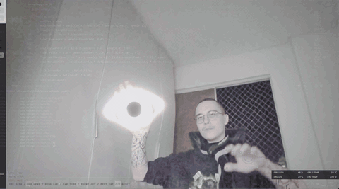

# EVENT HORIZON

Real-time gravitational lensing black hole over your live webcam, controlled entirely by your hands.

Your palm carries the singularity. Your pinch feeds it. Your room bends around it.



> drop a recording at `docs/demo.gif` (ShareX > gif region capture works great)

## What it does

- Live webcam feed warped by a Schwarzschild-style lensing shader: light wraps around the event horizon, an Einstein ring forms, pixels near the horizon sample the far side of your room
- Procedural accretion disk: fbm turbulence, Keplerian rotation (`w ~ r^-1.5`), blackbody gradient, Doppler beaming on the approaching side
- Photon ring at 1.5 rs, chromatic aberration in the lensed region, hash starfield drifting into the hole, HDR bloom
- MediaPipe hand tracking at camera framerate, GPU delegate, two-hand role system

## Controls

Two hands, two jobs.

### Hole hand (first hand seen)

| input | effect |
|---|---|
| palm position | moves the singularity |
| thumb + index pinch | mass: closed = max, open = shrinks away |
| wrist roll | tilts the accretion disk |
| flick + drop hand | hole keeps momentum, drifts and decays |

### Control deck (second hand)

| gesture | effect |
|---|---|
| thumb + index pinch | DISK: accretion brightness dial |
| thumb + middle pinch | LENS: warp power dial |
| thumb + ring pinch | HUE: blackbody orange > quasar blue |
| thumb + pinky pinch | TIME: bullet-time dial, 1.0x > 0.05x |
| point (index only) | relativistic jet aimed by your finger |
| fist | collapse: the hole eats itself |
| V sign held 0.5s | reset all dials |

Dials latch: pinch to adjust, release and the value stays. A cyber overlay renders on the control hand: neon skeleton, arc gauges with live values, jet targeting ray, collapse warning rings.

## Run it

```
npm install
npm run dev
```

Open http://localhost:5173, allow camera, show your hand.

## Stack

- Vite + TypeScript (strict)
- Three.js: single fullscreen quad + custom GLSL fragment shader, UnrealBloom post pass
- @mediapipe/tasks-vision HandLandmarker (GPU delegate, VIDEO mode, 21 landmarks per hand)
- 2D canvas overlay for the hand HUD, zero UI frameworks, zero other deps

## How the lensing works

Per fragment: radial deflection toward the hole proportional to `rs^2 / r`, allowed to exceed `r` near the horizon so the sample coordinate crosses to the opposite side of the hole, which is what mirrors the background into an Einstein ring. The accretion disk is computed in the *displaced* coordinate space, so the disk itself bends over the horizon. Horizon black always wins.

## Performance

Single shader pass + bloom. Pixel ratio capped at 2. Runs 165 fps at 1440p on an RX 9070 XT; anything with a working WebGL2 context should hold 60.

## Tags

`webgl` `glsl` `threejs` `shader` `gravitational-lensing` `black-hole` `mediapipe` `hand-tracking` `computer-vision` `interactive` `webcam` `vite` `typescript`
