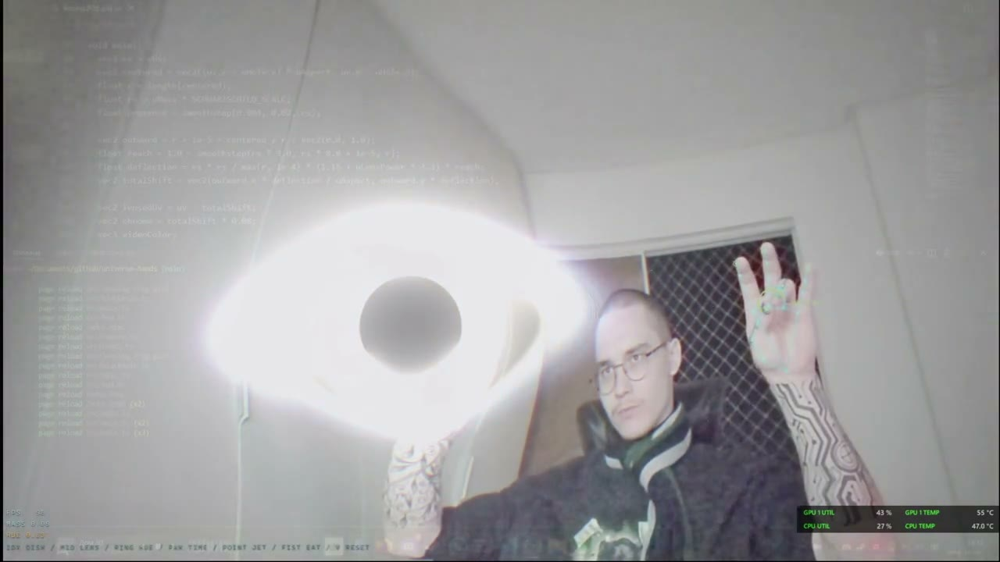
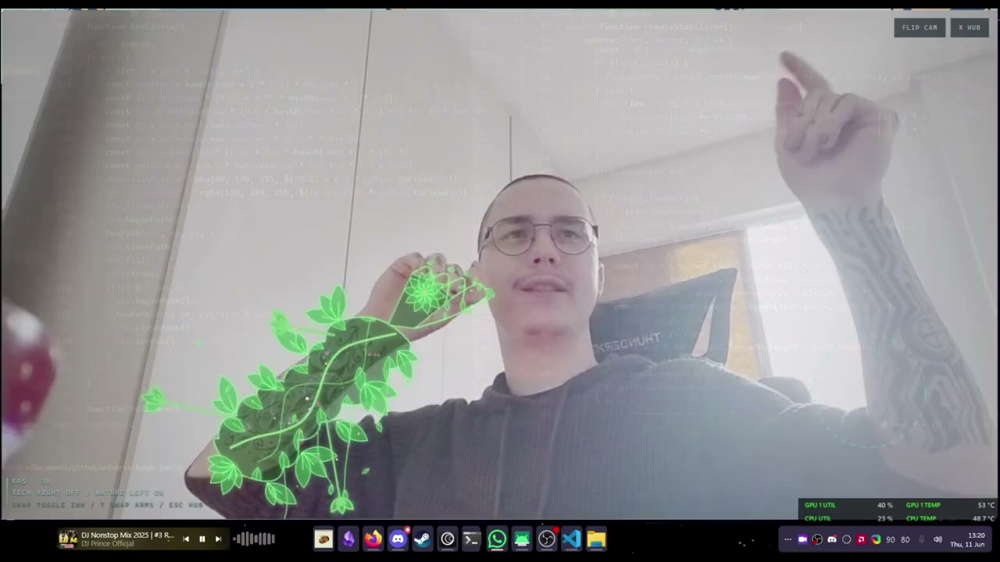

# UNIVERSE HANDS

Hand-driven visual instruments on your live webcam. Pick a visual from the hub, control it with your hands, no mouse, no UI chrome.

## Demos

Click to watch (with audio):

| EVENT HORIZON | LIVING INK |
|---|---|
| [](examples/blackhole.mp4) | [](examples/ink-tattoo.mp4) |

## Visuals

### 01 EVENT HORIZON

Gravitational lensing black hole. Your palm carries the singularity, your pinch feeds it, your room bends around it: light wraps the horizon, an Einstein ring forms, the accretion disk bends over the hole because it is computed in lensed coordinate space.

Two hands, two jobs:

| hole hand (first seen) | effect |
|---|---|
| palm position | moves the singularity |
| thumb + index pinch | mass: closed = max, open = shrinks away |
| wrist roll | tilts the accretion disk |
| flick + drop hand | hole keeps momentum, drifts and decays |

| control deck (second hand) | effect |
|---|---|
| thumb + index pinch | DISK: accretion brightness dial |
| thumb + middle pinch | LENS: warp power dial |
| thumb + ring pinch | HUE: blackbody orange > quasar blue |
| thumb + pinky pinch | TIME: bullet-time dial, 1.0x > 0.05x |
| point | relativistic jet aimed by your finger |
| fist | collapse: the hole eats itself |
| V sign held 0.5s | reset all dials |

Dials latch like real knobs. A cyber overlay renders on the control hand: neon skeleton, arc gauges with live values, jet targeting ray.

### 02 LIVING INK

Tattoo augmentation. One arm gets a cybertech overlay (animated PCB traces, data packets, CPU node ring, pads on the fingertips), the other gets living flora (swaying vines, sprouting leaves, dotwork, fireflies, a slowly spinning galaxy on the forearm). Arms picked by handedness, `T` swaps if the mirror confuses it.

### 03 PYROKINESIS

Fire from your palms. Open hand burns, fist snuffs it out, moving fast bends the plume behind your hand. Heat haze warps the video above the flames, embers rise off your hands. Works with both hands at once.

## Run it

```
npm install
npm run dev
```

Open http://localhost:5173, allow camera, pick a visual (click or 1-3), ESC returns to the hub.

## Stack

- Vite + TypeScript (strict)
- Three.js: single fullscreen quad + custom GLSL fragment shader per scene, UnrealBloom post pass
- @mediapipe/tasks-vision HandLandmarker (GPU delegate, VIDEO mode, 21 landmarks, handedness)
- 2D canvas overlays for hand HUDs and particles, zero UI frameworks, zero other deps

## Architecture

```
src/
  core/      camera, hand tracking, hud, render pipeline, 2d overlay
  scenes/
    blackhole/   lensing shader + control deck + cyber overlay
    tattoo/      grade shader + circuit/flora painters
    fire/        flame shader + spark particles
  hub.ts     scene picker
  main.ts    boot + shared frame loop
```

Each scene is a factory receiving the shared renderer, video, overlay canvas and HUD. Camera and hand tracker boot once; scenes mount and dispose cleanly.

## Performance

Single shader pass + bloom per scene, pixel ratio capped at 2. 165 fps at 1440p on an RX 9070 XT (tattoo scene runs two MediaPipe models, expect lower).

## Privacy

Everything runs client-side in your browser. Webcam frames are processed locally by MediaPipe WASM, nothing is uploaded anywhere, no analytics, no telemetry, no tracking of any kind. The only network requests are the one-time CDN fetches of the MediaPipe runtime and models at load. Open source and free.

## Deploy

Static site, no backend. `npm run build` outputs `dist/`. On Vercel: import the repo, framework preset Vite, deploy. Camera access requires HTTPS, which Vercel serves by default.

## Tags

`webgl` `glsl` `threejs` `shader` `gravitational-lensing` `black-hole` `mediapipe` `hand-tracking` `computer-vision` `interactive` `webcam` `vite` `typescript`
